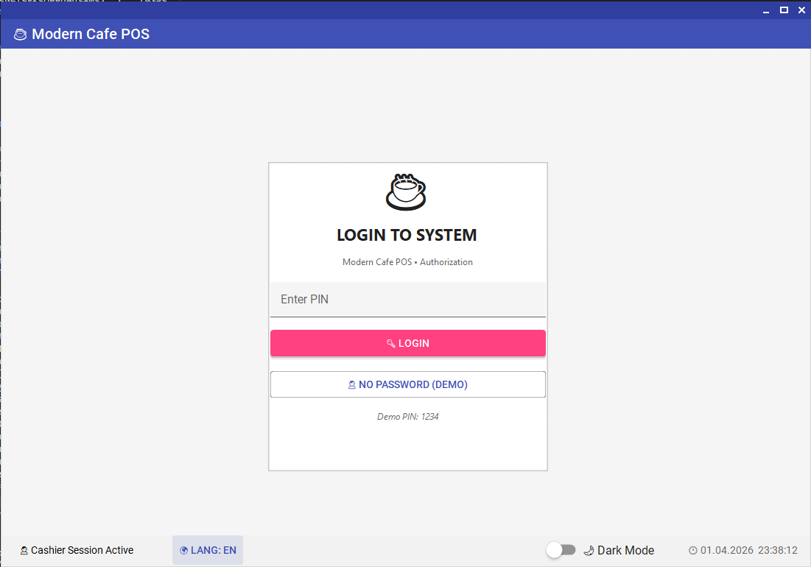
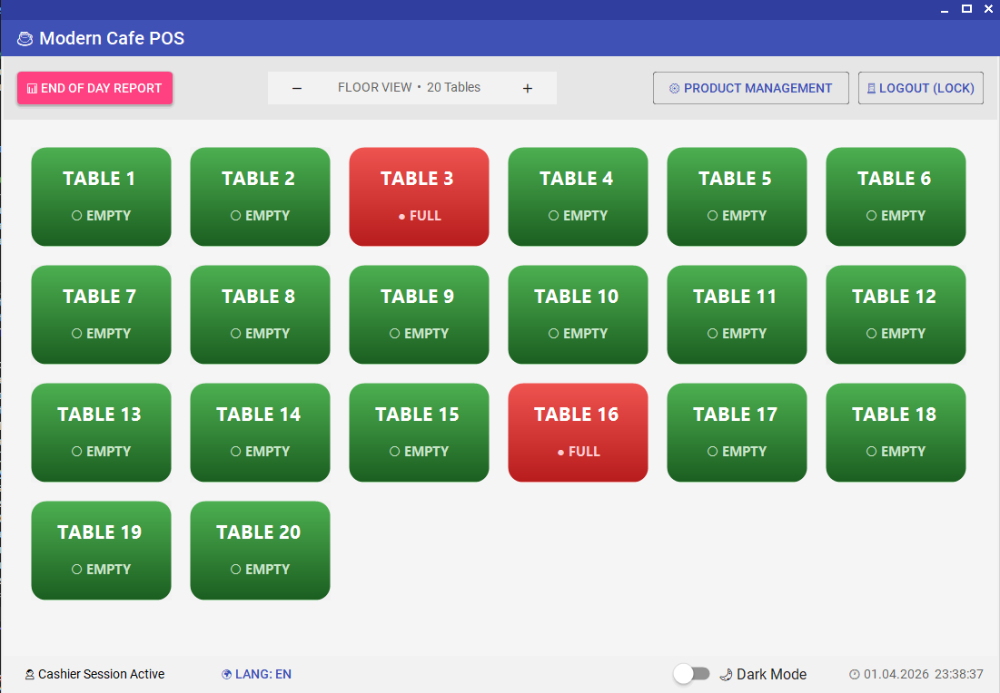
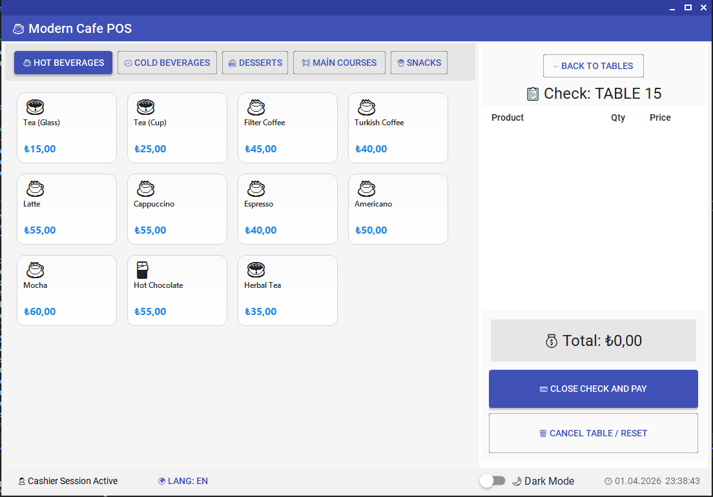

# Modern Cafe POS Sistem ☕

[TR] Bu proje, modern bir kafe veya restoranın ihtiyaç duyduğu temel operasyonları (sipariş yönetimi, masa takibi, ürün yönetimi ve raporlama) gerçekleştirmek üzere tasarlanmış bir Windows Forms uygulamasıdır.

[EN] This project is a modern Cafe/Restaurant POS system designed in Windows Forms, featuring order management, table tracking, product management, and sales reporting.

---

## 📸 Arayüz / UI

| Giriş Ekranı (Login) | Masalar (Tables) | Sipariş Ekranı (Order) |
|:---:|:---:|:---:|
|  |  |  |

---

## 🔥 Özellikler / Features

| Özellik (Feature) | Açıklama (Description) |
|---|---|
| **Table Management** | Masaların doluluk durumunu anlık takip edin. / Live table status. |
| **Order Screen** | Emojili ve sezgisel adisyon ekranı. / Intuitive check screen with emojis. |
| **Product Mgmt** | Ürün/Kategori ekleme, silme ve fiyat güncelleme. / Manage items & prices. |
| **Localization** | Tek tuşla TR/EN dil desteği. / One-click TR/EN language support. |
| **Modern UI** | Karanlık/Aydınlık mod desteği (MaterialSkin). / Dark/Light mode support. |
| **Reporting** | Günlük ciro ve geçmiş sipariş analizi. / Daily revenue & order history. |

---

## 🚀 Nasıl Çalıştırılır? / How to Run?

### [TR] Kurulum Adımları
1.  **Visual Studio 2022** veya benzeri bir IDE ile `.sln` dosyasını açın.
2.  **Build > Rebuild Solution** (Çözümü Yeniden Derle) seçeneğine tıklayın.
3.  **F5** tuşuna basarak uygulamayı çalıştırın.
4.  **Varsayılan PIN:** `1234` veya "ŞİFRESİZ GİRİŞ" butonunu kullanın.

### [EN] Setup Steps
1.  Open the `.sln` file with **Visual Studio 2022** or higher.
2.  Go to **Build > Rebuild Solution**.
3.  Press **F5** to start.
4.  **Default PIN:** `1234` or use "NO PASSWORD (DEMO)" button.

---

## 🛠️ Teknik Detaylar / Technical Stack

- **Framework:** .NET 9.0 (C#)
- **UI:** MaterialSkin 2.0 (Material Design)
- **Database:** SQLite (Automatic initialization & seeding)
- **Design Pattern:** TableLayoutPanel-based responsive layouts

---

> [!NOTE]
> Proje ilk çalıştırıldığında dondurma dahil tüm temel kategoriler ve ürünler otomatik olarak veritabanına eklenir. / On the first run, the database is automatically seeded with all common categories and products including ice cream.
